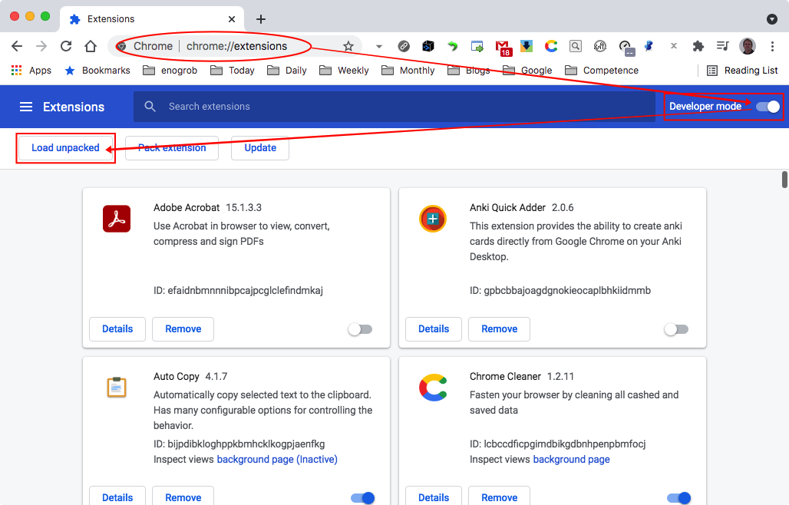

# Chrome Apps for DevOps


## Installation

### 1. Clone this repository and see its contents.
Open a terminal give the following command:

```bash
$ git clone https://github.com/enogrob/ChromeApps_DevOps.git
```

As we can see a subdirectory is created for each DevOps app.

```bash
$ ls -la
total 40
drwxr-xr-x@   8 enogrob  staff   272B Apr 28 18:48 ./
drwxr-xr-x+ 138 enogrob  staff   4.6K Apr 26 05:51 ../
-rw-r--r--@   1 enogrob  staff   6.0K Mar  2 11:58 .DS_Store
-rw-r--r--    1 enogrob  staff     7B Mar  2 11:58 .ruby-gemset
-rw-r--r--    1 enogrob  staff    11B Mar  2 11:58 .ruby-version
-rw-r--r--    1 enogrob  staff     0B Apr 28 17:24 20150202_202034_localhost.log
drwxr-xr-x   32 enogrob  staff   1.1K Apr 28 18:57 ChromeApps_DevOps/
-rw-r--r--    1 enogrob  staff   141B Apr 28 18:48 today_data.yaml

$ tree -L 1 ChromeApps_DevOps/
ChromeApps_DevOps/
├── DevOps-AmazonAWS
├── DevOps-BubbleConf
├── DevOps-Cygwin
├── DevOps-Docker
├── DevOps-DockerMachine
├── DevOps-Dockerhub
├── DevOps-Eclipse.org
├── DevOps-Excel2010Reference
├── DevOps-GistBox
├── DevOps-GoogleAppEngine
├── DevOps-GoogleGroups
├── DevOps-HTML
├── DevOps-Heroku
├── DevOps-Livecode
├── DevOps-MySQL
├── DevOps-PostgreSQL
├── DevOps-Powershell
├── DevOps-Sqlite
├── DevOps-Vagrant
├── DevOps-VirtualBox
├── Devops-Bitbucket
├── Devops-Github
├── Devops-Pigshell
├── Devops-Puppet
├── Devops-omniref
├── README.md
└── images

26 directories, 1 file
$
```

### 2. Open Chrome with the following url:
In order to load the `Chrome Apps` for Ruby, check `Developer Mode` and press `Load unpacked extension...` to load each App selecting its corresponding directory inside `ChromeApps_DevOps` e.g. `DevOps-DockerMachine`, and then repeat that for the wanted apps.

```
chrome://extensions/
```


### 3. After load the Chrome Apps wanted for DevOps, Chrome will look like the screenshot below:

