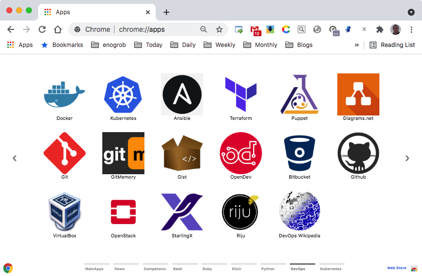

# Chrome Apps for DevOps


## Installation

### 1. Clone this repository and see its contents.
Open a terminal give the following command:

```bash
$ git clone https://github.com/enogrob/chromeapps-devops.git
```

As we can see a subdirectory is created for each DevOps app.

```bash
$ ls -la
total 1000
drwxr-xr-x@   9 enogrob  staff    306 Oct  4 07:32 .
drwxr-xr-x@ 298 enogrob  staff  10132 Oct  4 07:30 ..
-rw-r--r--@   1 enogrob  staff  14340 Sep 24  2017 .DS_Store
drwxr-xr-x   14 enogrob  staff    476 Oct  4 11:07 .git
-rw-r--r--@   1 enogrob  staff      6 Aug  1  2016 .gitignore
-rw-r--r--@   1 enogrob  staff      0 Nov 17  2016 Icon?
-rw-r--r--@   1 enogrob  staff   1895 Oct  4 11:08 README.md
drwxr-xr-x   18 enogrob  staff    612 Oct  4 11:04 apps
drwxr-xr-x    5 enogrob  staff    170 May 28  2016 images

$ tree -L 1 apps/
apps/
├── DevOps-Applicationize
├── DevOps-Docker
├── DevOps-Dockerhub
├── DevOps-Homebrew
├── DevOps-MySQL
├── DevOps-Neo4j
├── DevOps-PostgreSQL
├── DevOps-Redis
├── DevOps-Sidekiq
├── DevOps-Sqlite
├── Devops-Bitbucket
├── Devops-CloudAMQP
├── Devops-DevDocs
├── Devops-Git
├── Devops-Github
└── Devops-RabbitMQ

16 directories, 0 files
```

### 2. Open Chrome with the following url:
In order to load the `Chrome Apps` for Eicon, check `Developer Mode` and press `Load unpacked extension...` to load each App selecting its corresponding directory inside `apps` e.g. `DevOps-Docker`, and then repeat that for the wanted apps. Or just drag and drop the app folder on the [Extensions page](chrome://extensions).

[chrome://extensions](chrome://extensions)

### 3. After load the Chrome Apps wanted for DevOps, Chrome will look like the screenshot below:

